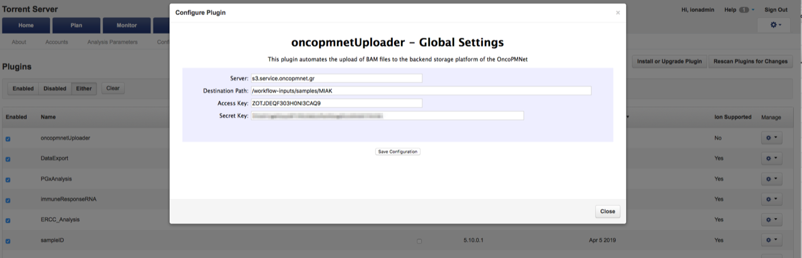
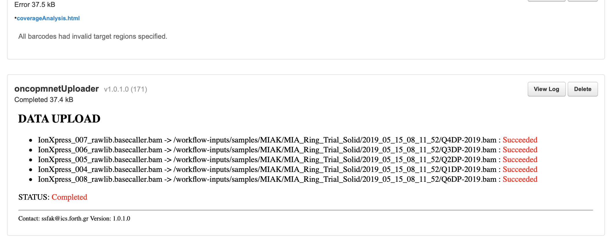

##  oncopmnetUploader

This is a custom plugin for Torrent Suite<sup>TM</sup> in order to allow the upload of Ion Torrent data (BAM files) to be uploaded to the onco-PMNet platform.

### Installation

It is important to have this code in a folder named `oncopmnetUploader` and this will be the case if you clone this repository without specifiying a different local directory, e.g. you should just do:

```bash
git clone git@gitlab.precmed.iit.demokritos.gr:sgsfak/oncopmnetUploader.git 
```

After that you need to package the newly created directory into a Zip file as described [here](https://ion-torrent-sdk.readthedocs.io/en/v5.10/plugin/getting_started.html#plugin-packaging). In  a Unix-like operating system you could issue the following command (assuming you are *not* inside the `oncopmnetUploader` directory):

```bash
zip --exclude \*.git\* --exclude \*img\* -r oncopmnetUploader oncopmnetUploader
```

The produced `oncopmnetUploader.zip` file can then be uploaded in the Torrent Suite<sup>TM</sup> server at the configure plugins GUI, by clicking the "Install or Upgrade plugin" button.	

The current implementation of the plugin uses the [MinIO Client](https://docs.min.io/docs/minio-client-quickstart-guide.html) command line tool so you need to download the Linux executable and copy it into the Torrent Server. The plugin assumes that the minio client executable `mc` is available as `/usr/local/bin/mc` so you need to copy it there (or change the `mc_command` variable in the `oncopmnetUploader.py` source code).

### Configuration

After the upload of the plugin you need to configure it globally (i.e. it will be done once and the configured information will then be available in all future runs). The configuration can be done from the "Configure" option available in the "cog" button of the plugin's row. 

The following screenshot shows the options available. You need to set the S3 server address, the "access key", and "secret key" for contacting the backend object storage. Also you need to specify the bucket and folder where the BAM files will be uploaded to.




### Execution

After installation and configuration the plugin should be available to be selected to run in a specific "Run". The plugin should take automatically the run information and upload all the associated BAM files in the server configured.

The following image depicts the information shown after running the plugin. The plugin creates the subfolders in the configured directory based on Run's date, Project, and Sample name.

